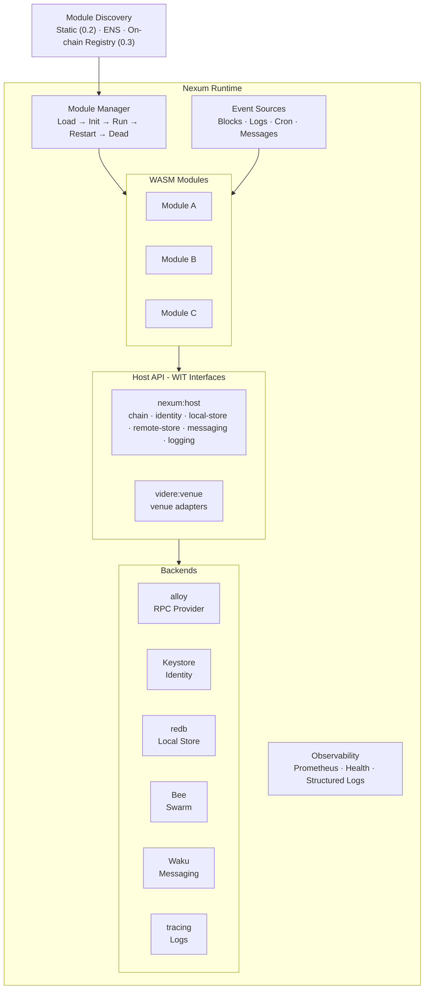
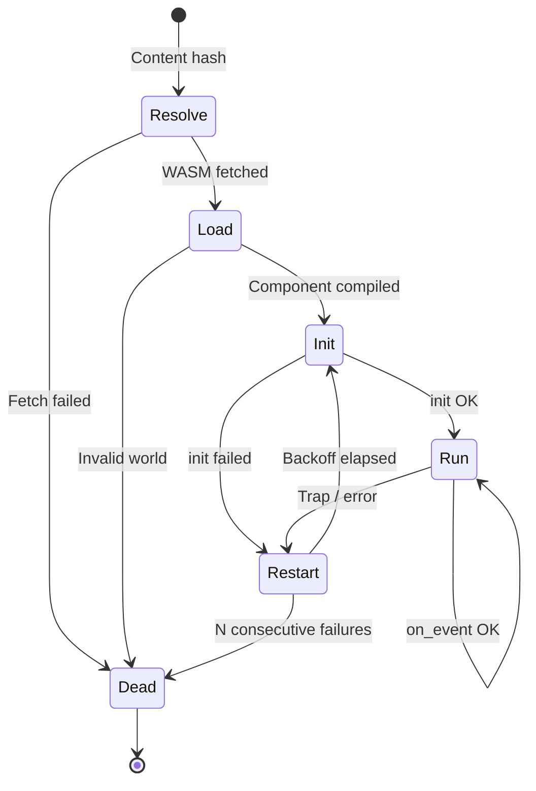

# Nexum: Universal WASM Component Model Runtime

Nexum is a WASM Component Model runtime that provides secure, sandboxed execution for WebAssembly modules. Modules react to blockchain events, read chain state, persist data locally and to decentralised storage, and communicate via decentralised messaging, all within a capability-based sandbox with zero implicit permissions.

**Shepherd** is the Nexum distribution that adds CoW Protocol support. A module compiled against the universal `nexum:host/event-module` world runs on any Nexum-compatible host. CoW order submission is provided by the `videre:venue` venue-adapter layer (see doc 08), not by a domain-specific host interface.

### Vocabulary: engine vs. host (`nexum` vs. `nexum:host`)

| Term | What it is | Where you find it |
|---|---|---|
| **engine** (`nexum`) | A concrete implementation that loads and runs WASM components. The 0.2 reference engine is a wasmtime-based server daemon. | `nexum/crates/nexum-runtime/`, the `nexum` binary, `cargo run -p nexum-cli` |
| **host** (`nexum:host`) | The WIT contract: the host-imported interfaces (chain, identity, local-store, ...), types, and worlds that every engine implements and every module imports. | `wit/nexum-host/`, `package nexum:host@0.1.0`, Rust path `nexum::host::*` |

An engine implements `nexum:host` so that modules built against `nexum:host` can run on it. The reference engine ships as two crates: the `nexum-runtime` library (embeddable, no CLI surface) and the `nexum` binary in `nexum/crates/nexum-cli`. A Rust embedder constructs an `EngineConfig` in code and calls `nexum_runtime::bootstrap::run_from_config`; see `nexum/crates/nexum-runtime/examples/embed.rs`.

## Architecture



## Design Principles

- **Component Model from day 1** - WIT-defined API contract; structural sandboxing (no filesystem, no ambient network); multi-language guests.
- **Declarative subscriptions** - modules declare events in their manifest; the runtime wires sources.
- **Durable state** - each local-store write is its own fsync-durable committed transaction; state survives traps and restarts.
- **Content-addressed distribution** - modules are fetched by hash; integrity always verified.
- **Self-hosted** - no centralised dependency; operator runs their own node.

## The Six Primitives

Every module has access to six orthogonal capabilities through the `nexum:host` WIT package:

| Primitive | Interface | Purpose | Scope | Backend (Server) |
|-----------|-----------|---------|-------|-------------------|
| **Chain** | `chain` | Read/write blockchain state via JSON-RPC | Global (per chain) | alloy Provider |
| **Identity** | `identity` | Key management and message signing | Per-account | Keystore / KMS / HSM |
| **Local Store** | `local-store` | Per-module key-value persistence | Device-local, per-module | redb |
| **Remote Store** | `remote-store` | Decentralised content-addressed storage | Global (content-addressed) | Ethereum Swarm |
| **Messaging** | `messaging` | Decentralised pub/sub messaging | Topic-based | Waku |
| **Logging** | `logging` | Diagnostic output | Per-module | tracing |

The `chain` host implementation depends on `identity`: signing RPC methods (`eth_sendTransaction`, `eth_accounts`, `eth_signTypedData_v4`, `personal_sign`) delegate to the identity backend. Modules may also import `identity` directly for raw signing.

## Additive 0.2 Capabilities

Beyond the six core primitives, 0.2 adds one optional capability modules declare in their manifest:

- **`http`** - allowlisted outbound HTTP via `wasi:http/outgoing-handler`, gated by a `[capabilities.http].allow` domain list. The host enforces the allowlist on every request: an off-list host is denied before any connection is made. The SDK's `http::fetch` helper wraps the interface.

Time and secure randomness are WASI concerns: `wasi:clocks` and `wasi:random` are linked into every module store ambiently.

0.2 also publishes (but does not host) the experimental **`query-module`** world for request/response modules. The WIT is provisional and may change without a major bump; it is a target for mock-host tests only.

## WIT Worlds

The WIT is layered. The universal `nexum:host` package provides blockchain-agnostic capabilities; domain packages layer on top.

```
package nexum:host@0.1.0

world event-module {
    import chain          - consensus access (JSON-RPC passthrough)
    import identity       - key management and message signing
    import local-store    - local key-value persistence
    import remote-store   - decentralised storage (Swarm)
    import messaging      - decentralised messaging (Waku)
    import logging         - log (trace/debug/info/warn/error)

    export init(config)    - called once on load
    export on_event(event) - called per subscribed event (block, logs, tick, message)
}
```

The `event-module` world imports no WASI interfaces. `wasi:clocks` and `wasi:random` are linked ambiently, and modules that declare the `http` capability additionally import `wasi:http`. The `chain` interface exposes a single generic `request` function (plus an additive `request-batch`); the SDK implements alloy's `Transport` on top of it, giving modules the full alloy `Provider` API with zero WIT churn.

CoW Protocol support is two packages. `shepherd:cow@0.1.0` carries `cow-events`, the canonical decoded on-chain event enum (topic-0 hashes for `ConditionalOrderCreated`, `ConditionalOrderRemoved`, `OrderPlacement`) that keepers and manifests are parity-tested against. Order submission is the `videre:venue@0.1.0` venue-adapter contract: a keeper drives venues through `videre:venue/client` by name, and each installed adapter component exports the provider face for one venue (the CoW venue is the `cow-venue` crate). See doc 08.

> Design rationale: [07-rpc-namespace-design.md](07-rpc-namespace-design.md) | Platform generalisation and the venue layer: [08-platform-generalisation.md](08-platform-generalisation.md) | Full WIT: [01-runtime-environment.md](01-runtime-environment.md)

## Technology Stack

| Concern | Choice | Version |
|---------|--------|---------|
| Language | Rust | 1.90+ |
| WASM runtime | wasmtime (Component Model) | 45.x |
| API contract | WIT (`nexum:host@0.1.0`) | - |
| Guest bindings | wit-bindgen | 0.57.x |
| Async | Tokio | - |
| Ethereum RPC | alloy | 1.5.x |
| Local store | redb | 3.1.x |
| Logging | tracing + tracing-subscriber | - |
| Metrics | metrics + metrics-exporter-prometheus | - |
| Deployment | Docker | - |
| License | AGPL-3.0 | - |

## Module Package

A module ships as a **bundle**: a manifest (`module.toml`) plus a compiled WASM component.

```toml
# module.toml
[module]
name = "twap-monitor"
version = "0.3.0"
component = "sha256:9f86d081…"  # content hash of module.wasm

[capabilities]
required = ["chain", "local-store", "logging"]
optional = ["messaging", "remote-store"]

[[subscription]]
kind = "block"
chain_id = 42161

[config]
slippage_bps = 50               # integers stay integers
```

The manifest declares chain requirements, event subscriptions, capability grants, and typed module config. `[capabilities]` is the canonical place to declare needed host primitives; the engine cross-checks the component's WIT imports against `required` + `optional` at boot (link-time) and refuses to instantiate a module that imports an undeclared capability. Omitting `[capabilities]` falls back to "all imports required" with a deprecation warning.

Resource caps are global in 0.2, set in `engine.toml` `[limits]` (`fuel_per_event`, default 1B; `memory_bytes`, default 64 MiB; `state_bytes`, default 50 MiB; `event_deadline_secs`, default 120). Per-module `[module.resources]` overrides are a 0.3 direction.

-> Full spec: [02-modules-events-packaging.md](02-modules-events-packaging.md)

## Module Discovery

0.2 loads modules from local filesystem paths listed in `engine.toml`. ENS `contenthash` resolution and on-chain registry discovery are a 0.3 design direction.

-> Full design and current status: [03-module-discovery.md](03-module-discovery.md)

## Module Lifecycle



- **Resolve**: fetch WASM by content hash (local in 0.2).
- **Load**: compile `Component`, validate WIT world, create `InstancePre`.
- **Init**: create `Store`, instantiate, call `init(config)`.
- **Run**: dispatch subscribed events to `on_event`. Each call gets a fuel budget.
- **Restart**: on crash, exponential backoff (1s -> 5min cap), fresh `Store`, state persists.
- **Dead**: after N consecutive failures (poison pill), requires manual intervention.

-> Full lifecycle: [02-modules-events-packaging.md](02-modules-events-packaging.md)

## Event System

- **Sources**: `block` (new heads via `eth_subscribe`), `chain-log` (filtered contract events), `cron` (schedule-based), `message` (Waku content topics).
- **Shared subscriptions**: one block subscription per chain, fanned out to all subscribed modules.
- **Dispatch**: concurrent across modules, sequential within a module (ordered delivery).
- **Declared in manifest**: `[[subscription]]` blocks; the runtime wires sources.

-> Full design: [02-modules-events-packaging.md](02-modules-events-packaging.md)

## Local Store

- **Backend**: redb (pure Rust, ACID, MVCC, crash-safe).
- **Isolation**: modules cannot access each other's state.
- **Transactions**: each store call commits its own redb transaction; there is no per-event atomic rollback.
- **Survives restarts**: state is external to the WASM instance.
- **Isolation**: single redb file, 32-byte `keccak256(module_name)` key prefix (ADR-0003).
- **Size enforcement**: `[limits].state_bytes` quota, enforced host-side.
- **Prefix scanning**: `list-keys(prefix)` for namespaced keys.

-> Full design: [04-state-store.md](04-state-store.md)

## SDK

The guest SDK ships as `nexum-sdk` (the generic module SDK: host-trait seam, chain/config/address helpers, `http::fetch`, tracing facade) with `nexum-sdk-test` for the mock-host surface, and `videre-sdk` (the venue and keeper SDK: the `venue-adapter` export trait and the typed venue client) with `videre-test`. Modules are built with `cargo build --target wasm32-wasip2 --release`. The operator CLI is the `nexum` binary itself.

Multi-language support: authors can target the WIT world directly from Rust, C/C++, Go, JavaScript, or Python via `wit-bindgen`. The SDK is a Rust ergonomics layer.

-> Full design: [05-sdk-design.md](05-sdk-design.md) | Host-trait seam: [ADR-0009](adr/0009-host-trait-surface.md)

## Production Hardening

| Resource | Mechanism | On breach |
|----------|-----------|-----------|
| CPU (deterministic) | Fuel | Trap -> restart |
| CPU (wall-clock) | Epoch interruption + dispatch deadline | Yield / abort dispatch |
| Memory | `ResourceLimiter` | `memory.grow` denied |
| Storage | Host-side tracking | `local-store::set` returns `fault.invalid-input` |

Each interface declares its own typed error over a shared payload-bearing `fault` vocabulary (`unsupported`, `unavailable`, `denied`, `rate-limited`, `timeout`, `invalid-input`, `internal`). Interfaces with nothing to add report `fault` directly; `chain-error` embeds `fault` and adds an `rpc` case. See [ADR-0011](adr/0011-per-interface-typed-errors.md).

Observability: `tracing` JSON to stdout; a Prometheus exporter on `127.0.0.1:9100/metrics` when `[engine.metrics]` is enabled (disabled by default).

-> Full design: [06-production-hardening.md](06-production-hardening.md)

## Platform Generalisation

The `nexum:host` WIT contract is host-portable: any host implementing it can run modules unchanged. The 0.2 reference runtime is server-only (Rust/Tokio/wasmtime). Mobile, WebView, and super-app targets are architectural direction.

-> Full design and the venue layer: [08-platform-generalisation.md](08-platform-generalisation.md)

## Repository Structure

```
shepherd/
├── crates/
│   ├── nexum-runtime/      Core WASM host (server) library: event system, local store, bootstrap
│   ├── nexum-cli/          The `nexum` binary: clap CLI over the runtime library
│   ├── nexum-sdk/          Generic guest SDK: host-trait seam, chain/config/address helpers, wasi:http fetch
│   ├── nexum-sdk-test/     Generic mock host for module tests
│   ├── videre-sdk/         Venue + keeper SDK: venue-adapter export trait, typed venue client
│   ├── videre-host/        Host-side venue registry + status watch
│   ├── videre-test/        Venue/keeper test surface
│   └── cow-venue/          The CoW venue: order body types + IntentBody codec
├── modules/
│   ├── twap-monitor/       TWAP order monitoring module
│   ├── ethflow-watcher/    Ethflow order monitoring module
│   └── examples/           reference modules (price-alert, balance-tracker, http-probe, echo-*)
├── wit/
│   ├── nexum-host/         Universal WIT package (chain, identity, local-store, remote-store, messaging, logging)
│   ├── shepherd-cow/       CoW event enum (cow-events)
│   └── videre-venue/       Venue-adapter contract (client + adapter faces)
├── Dockerfile
├── docker-compose.yml
└── docs/
    ├── 00-overview.md … 08-platform-generalisation.md
    ├── adr/                Architectural decision records
    ├── deployment/         Docker + Prometheus operator config
    ├── diagrams/           Mermaid diagrams + reference captions
    ├── operations/         Runbooks
    ├── production.md       Operator handbook
    ├── sdk.md              Module-author entry point
    └── tutorial-first-module.md
```
