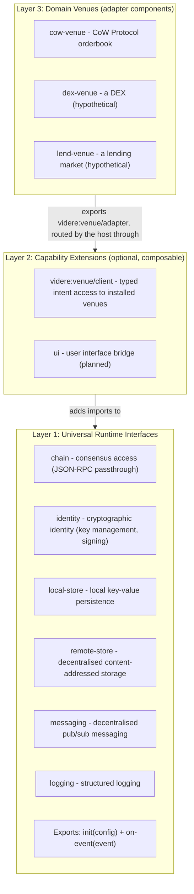
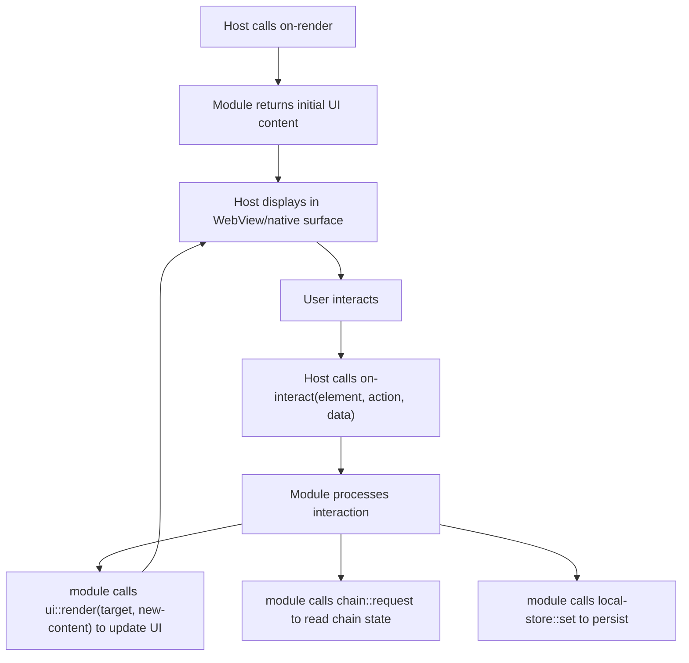
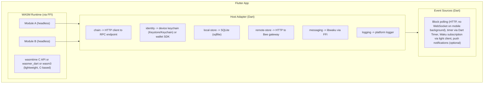
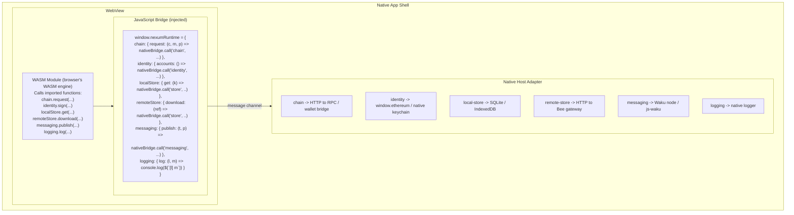
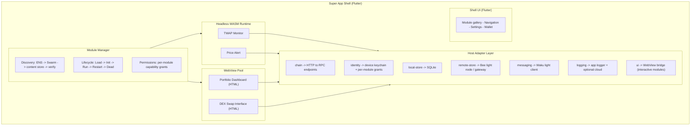

# Platform Generalisation

> **Status (0.2):** Nexum is **designed** to be portable to mobile and browser hosts; the 0.2 **reference runtime is server-only**. The mobile, WebView, and super-app targets in this document describe architectural direction, not shipping artifacts. They remain in the docs because they're load-bearing design - the WIT contract is shaped by the requirement that all four can implement it - but they are **planned** work, conditional on a named design partner for 0.3. See the per-target rows below for current status.

## Motivation

The Nexum runtime (docs 01-07) is designed as a server-side Rust binary embedding wasmtime. But the core abstractions - WIT-defined host interfaces, content-addressed module distribution, declarative manifests - are not inherently server-specific. The same module binary, the same packaging, and the same distribution mechanism are intended to serve multiple platform targets:

1. **Server runtime** *(shipping in 0.2)* - the current design (Rust/Tokio/wasmtime). Headless automation: blockchain event monitoring, order submission, background computation.
2. **Mobile app (Flutter/Dart)** *(planned - see roadmap)* - a WASM runtime embedded in a native mobile application via FFI. Modules run on-device, backed by local state (SQLite) and RPC over HTTP.
3. **WebView** *(planned - see roadmap)* - a browser engine (V8/JSC/SpiderMonkey) executing WASM natively, with host functions injected from the native layer via a JavaScript bridge. Enables rich web-based UIs with blockchain-native capabilities.
4. **Decentralised super app** *(planned - see roadmap)* - a shell application (mobile or desktop) that dynamically loads modules discovered via ENS and fetched from Swarm. Some modules are headless (automation); others are interactive (UI). All are sandboxed, all are distributed without a central app store.

The key insight: **the WIT contract is the universal interface**. Any host that implements the required interfaces can run the same module binary. The differences between platforms are in *how* the host implements those interfaces - not in what the module sees.

This document defines the layered architecture that enables this generalisation and specifies the universal interface set. The 0.2 server runtime is the first host implementation; the experimental `nexum:host/query-module` WIT world (published but unhosted in 0.2) exists to give mobile/wallet embedders a stable target to implement against before 0.3.

## Primitive Taxonomy

Before diving into WIT definitions, the universal runtime is built on six primitive capabilities. These are the fundamental building blocks that any decentralised application needs:

| Primitive | Interface | Backed by | Purpose |
|-----------|-----------|-----------|---------|
| **Chain** | `chain` | JSON-RPC (eth_*) | Read/write blockchain consensus state |
| **Identity** | `identity` | Keystore / KMS / device keychain / wallet extension | Cryptographic identity - key management and signing |
| **Local Store** | `local-store` | redb / SQLite / IndexedDB | Per-module private persistence on the device |
| **Remote Store** | `remote-store` | Ethereum Swarm | Decentralised content-addressed storage |
| **Messaging** | `messaging` | Waku | Decentralised pub/sub messaging |
| **Logging** | `logging` | tracing / console | Diagnostic output |

These six primitives are orthogonal:

- **Chain** is the source of truth - the blockchain consensus state. Modules read chain state and (indirectly) write to it via order submission or transactions.
- **Identity** is cryptographic agency - key management and signing. Modules can enumerate available accounts and request signatures (ECDSA secp256k1 by default, extensible). The `chain` host implementation depends on `identity` internally - signing RPC methods (e.g. `eth_sendTransaction`) delegate to `identity` for the actual signature.
- **Local Store** is the module's private scratchpad - fast, local, scoped to one module on one device. Does not replicate.
- **Remote Store** is shared persistent content - content-addressed, decentralised, survives independent of any device. Any module on any device can read what another module wrote.
- **Messaging** is real-time communication - ephemeral pub/sub messages between modules, devices, or users. Unlike remote store (persistent, content-addressed), messaging is transient and topic-based.
- **Logging** is diagnostics - one-way output for debugging and monitoring. Not a data channel.

Together they cover the full spectrum: persistent truth (chain), cryptographic agency (identity), local scratch (local-store), shared content (remote-store), real-time coordination (messaging), and diagnostics (logging).

The 0.2 `event-module` world imports all six. (In 0.1 the WIT inadvertently omitted `identity` from the world definition despite the docs claiming six primitives; 0.2 makes the contract match the taxonomy.) Two additional **additive** capabilities are declared via the manifest's `[capabilities]` section but are not part of the six-primitive core: `http` (allowlisted), serviced by the standard `wasi:http/outgoing-handler` interface rather than a `nexum:host` one, and `client`, the `videre:venue/client` intent surface (see [Layer 3](#layer-3-domain-extensions-venue-adapters)).

## Architectural Principle: Layered WIT Worlds

Universal runtime capabilities and domain-specific surfaces live in separate layers:



Layer 1 is the world every module compiles against. A Layer 2 capability adds an import to a module's manifest-derived world: a keeper module declares `client` and gains `videre:venue/client`. Layer 3 is not a world at all: a domain enters the system as a **venue adapter component** installed into the host's venue registry, and modules reach it through the Layer 2 client interface. No module compiles against a domain world - see [Layer 3](#layer-3-domain-extensions-venue-adapters).

## Layer 1: Universal Interfaces

These six interfaces form the universal runtime contract. Any platform - server, mobile, WebView, desktop - can implement them.

### `chain` - Consensus Access

The module's window into blockchain consensus. A single generic function that forwards JSON-RPC requests to the host's provider infrastructure, plus an additive batched variant. The host decides *how* to reach the chain - the module only specifies *what* to ask.

```wit
interface chain {
    use types.{chain-id, fault};

    /// A structured JSON-RPC error carrying the node code and revert bytes.
    record rpc-error { code: s32, message: string, data: option<list<u8>> }

    /// Either a shared host `fault` or a structured JSON-RPC error.
    variant chain-error { fault(fault), rpc(rpc-error) }

    /// Execute a JSON-RPC request against the specified chain.
    ///
    /// The host routes to its configured provider for the given chain,
    /// applying whatever middleware is appropriate for the platform
    /// (timeout, retry, rate-limit, fallback on server; simple HTTP
    /// on mobile; window.ethereum or injected provider in WebView).
    ///
    /// `method` includes the namespace prefix (e.g. "eth_call").
    /// `params` and the success value are JSON-encoded strings.
    request: func(chain-id: chain-id, method: string, params: string)
        -> result<string, chain-error>;

    /// Additive 0.2 method: batched JSON-RPC.
    request-batch: func(chain-id: chain-id, calls: list<tuple<string, string>>)
        -> result<list<result<string, chain-error>>, chain-error>;
}
```

**Platform implementations:**

| Platform | `chain::request` backed by |
|----------|--------------------------|
| Server (Nexum) | alloy provider with tower middleware (timeout, retry, rate-limit, fallback) |
| Mobile (Flutter) | HTTP client (reqwest via FFI, or Dart `http` package) to configured RPC endpoint |
| WebView | JavaScript bridge -> `window.ethereum` (injected wallet) or native HTTP via message channel |
| Super app | Same as mobile, with per-module chain permissions |

The Rust SDK's `HostTransport` (doc 07) works identically on all platforms - it implements alloy's `Transport` trait over `chain::request`, so module authors get the full alloy `Provider` API regardless of where the module runs.

### `identity` - Cryptographic Identity

Provides key management and signing capabilities to modules. ECDSA secp256k1 by default (the Ethereum standard), extensible to other schemes. Modules can enumerate available accounts and request signatures over arbitrary data.

The `chain` host implementation depends on `identity` internally - signing RPC methods such as `eth_sendTransaction` or `eth_signTypedData_v4` delegate to `identity` for the actual cryptographic signature. Modules can also import `identity` directly for raw signing operations outside of JSON-RPC (e.g. signing EIP-712 typed data for off-chain order submission).

```wit
interface identity {
    use types.{fault};

    /// List available accounts (public keys or addresses).
    /// Returns a list of account identifiers (e.g. 20-byte Ethereum addresses).
    accounts: func() -> result<list<list<u8>>, fault>;

    /// Sign arbitrary data with the specified account's private key.
    /// Returns the signature bytes (e.g. 65-byte ECDSA signature with recovery id).
    sign: func(account: list<u8>, data: list<u8>) -> result<list<u8>, fault>;

    /// Sign EIP-712 typed structured data.
    /// `typed-data` is the JSON-encoded EIP-712 typed data structure.
    /// Returns the signature bytes.
    sign-typed-data: func(account: list<u8>, typed-data: string) -> result<list<u8>, fault>;
}
```

**Platform implementations:**

| Platform | `identity` backed by |
|----------|---------------------|
| Server (Nexum) | Keystore file, AWS KMS, or HSM |
| Mobile (Flutter) | Device keychain (Keystore/Keychain) or wallet SDK |
| WebView | window.ethereum (wallet extension) or native bridge to keychain |
| Super app | Device keychain + per-module permission grants |

**Relationship with `chain`:**

The `chain` host implementation uses `identity` internally when it encounters signing methods. For example, when a module calls `chain::request` with `eth_sendTransaction`, the host:

1. Constructs the transaction from the JSON-RPC params.
2. Calls `identity::sign` to produce the signature.
3. Sends the signed transaction via the provider.

This means modules that only need to sign transactions via standard JSON-RPC methods do not need to import `identity` directly - `chain` handles it transparently. Modules that need raw signing (e.g. off-chain message signing for order submission, attestations, or custom protocols) import `identity` explicitly.

### `local-store` - Local Key-Value Persistence

The module's private scratchpad. **Local to the device/process** - does not replicate, sync, or share across instances. Scoped to one module: module A cannot read module B's local state.

```wit
interface local-store {
    use types.{fault};

    /// Get a value by key. Returns None if the key does not exist.
    get: func(key: string) -> result<option<list<u8>>, fault>;

    /// Set a key-value pair. Overwrites any existing value.
    /// The host MAY enforce a size quota; if exceeded, returns fault.invalid-input.
    set: func(key: string, value: list<u8>) -> result<_, fault>;

    /// Delete a key. No-op if the key does not exist.
    delete: func(key: string) -> result<_, fault>;

    /// List all keys matching a prefix. Empty prefix returns all keys.
    list-keys: func(prefix: string) -> result<list<string>, fault>;
}
```

**Platform implementations:**

| Platform | `local-store` backed by |
|----------|-------------------------|
| Server (Nexum) | redb (per-module database file, ACID, MVCC) |
| Mobile (Flutter) | SQLite (per-module table or database, via `sqflite`) |
| WebView | IndexedDB (per-module object store) or `localStorage` |
| Super app | SQLite (shared database, per-module namespace isolation) |

The semantics are deliberately minimal - get, set, delete, prefix scan. This is the LCD (lowest common denominator) that every platform can implement efficiently. Advanced features (transactions, MVCC, crash-safety) are host-specific and not exposed in the WIT.

The server runtime's all-or-nothing transactional semantics (doc 04) remain an implementation detail of the Nexum host, not a guarantee modules can rely on across platforms. Modules that need stronger guarantees should design for idempotency.

### `remote-store` - Decentralised Content-Addressed Storage

Backed by Ethereum Swarm. Provides decentralised persistence beyond the local device - content-addressed, censorship-resistant, and accessible from any host on any device.

Swarm is both the distribution mechanism (modules are fetched from Swarm) and a runtime capability. This interface closes the loop - modules can publish to the same network they were distributed through.

```wit
interface remote-store {
    use types.{fault};

    /// Upload raw data to the decentralised store.
    /// Returns the 32-byte content reference (Swarm address).
    ///
    /// The host routes to its configured Bee node. Postage batch
    /// management is the host's responsibility - the module only
    /// provides data and gets back a reference.
    upload: func(data: list<u8>) -> result<list<u8>, fault>;

    /// Download raw data by 32-byte content reference.
    ///
    /// The host fetches from its Bee node or a public gateway.
    /// Returns the raw bytes. The caller is responsible for
    /// interpreting the content (JSON, protobuf, WASM, etc.).
    download: func(reference: list<u8>) -> result<list<u8>, fault>;

    /// Read the latest value from a mutable feed.
    ///
    /// Feeds are mutable pointers: (owner, topic) -> latest chunk.
    /// `owner`: 20-byte Ethereum address of the feed owner.
    /// `topic`: 32-byte topic hash.
    ///
    /// Returns None if the feed has no updates.
    read-feed: func(
        owner: list<u8>,
        topic: list<u8>,
    ) -> result<option<list<u8>>, fault>;

    /// Update a mutable feed with new data.
    ///
    /// The host signs the feed update with its configured identity
    /// (Bee node's Ethereum key). Only the host's own feeds can be
    /// updated - the owner is implicit (the host's address).
    ///
    /// `topic`: 32-byte topic hash.
    /// `data`: the payload to publish.
    ///
    /// Returns the 32-byte reference of the new chunk.
    write-feed: func(
        topic: list<u8>,
        data: list<u8>,
    ) -> result<list<u8>, fault>;
}
```

**Platform implementations:**

| Platform | `remote-store` backed by |
|----------|--------------------------|
| Server (Nexum) | Direct Bee API (`http://localhost:1633`) |
| Mobile (Flutter) | Bee API via HTTP (local light node or remote gateway) |
| WebView | JavaScript bridge -> native HTTP to Bee gateway |
| Super app | Embedded Bee light node or gateway proxy |

**Why remote-store as a universal interface:**

- **Decentralised persistence.** `local-store` is device-local. `remote-store` gives modules access to content-addressed storage that persists independent of any single device.
- **Content distribution.** Modules can publish data (feeds, references) that other modules or users can consume - without a central server.
- **Cross-device coordination.** Two instances of the same module on different devices can share data via feed topics - one writes via `write-feed`, the other reads via `read-feed`.
- **Consistency with distribution model.** Modules are already fetched from Swarm (doc 02, 03). Exposing `remote-store` at runtime means modules participate in the same content-addressed network they were distributed through.

### `messaging` - Decentralised Messaging

Backed by Waku. Provides real-time, privacy-preserving pub/sub messaging between modules, devices, and users. Unlike `remote-store` (persistent, content-addressed), `messaging` is transient and topic-based - fire-and-forget messages on content topics.

```wit
interface messaging {
    use types.{fault};

    record message {
        content-topic: string,
        payload: list<u8>,
        timestamp: u64,        // milliseconds since Unix epoch, UTC
        /// Optional sender identity (protocol-dependent).
        sender: option<list<u8>>,
    }

    /// Publish a message to a content topic.
    ///
    /// The host routes to its configured Waku node. The message is
    /// propagated to all subscribers of the content topic via the
    /// Waku relay (gossipsub) or light push protocol.
    ///
    /// Content topics follow the format: /<app>/<version>/<topic>/<encoding>
    /// e.g. "/nexum/1/twap-updates/proto"
    publish: func(content-topic: string, payload: list<u8>) -> result<_, fault>;

    /// Query historical messages from the Waku store protocol.
    ///
    /// Returns messages matching the content topic within the
    /// optional time range. Not all hosts support store queries
    /// (depends on Waku node configuration).
    query: func(
        content-topic: string,
        start-time: option<u64>,
        end-time: option<u64>,
        limit: option<u32>,
    ) -> result<list<message>, fault>;
}
```

**Receiving messages** is handled through the event system, not the `messaging` interface. Modules declare message subscriptions in their manifest, and the host delivers them as events:

```toml
[[subscription]]
kind = "message"
content_topic = "/nexum/1/twap-updates/proto"
```

The event variant in 0.2 carries `message` as a first-class variant:

```wit
record message {
    content-topic: string,
    payload: list<u8>,
    timestamp: u64,           // milliseconds since Unix epoch, UTC
    sender: option<list<u8>>,
}

variant event {
    block(block),
    chain-logs(chain-logs),
    tick(tick),
    message(message),
}
```

This follows the same pattern as all other event sources: sending uses the import interface (`messaging::publish`), receiving uses the declarative subscription + `on-event` dispatch.

**Platform implementations:**

| Platform | `messaging` backed by |
|----------|-----------------|
| Server (Nexum) | Waku node (nwaku or go-waku) via JSON-RPC or REST API |
| Mobile (Flutter) | Waku light client via FFI (libwaku) or HTTP to remote Waku node |
| WebView | JavaScript bridge -> native Waku client, or js-waku in-browser |
| Super app | Embedded Waku light node |

**Why messaging as a universal interface:**

- **Module-to-module communication.** Two modules on different devices can exchange real-time messages via shared content topics. The TWAP monitor on a server can notify a mobile dashboard module that a new part was posted.
- **User notifications.** A headless server module can publish an alert to a content topic; the user's mobile app module subscribes and displays a notification.
- **Decentralised coordination.** Multiple instances of the same module (e.g. running on different operator nodes) can coordinate via messaging - leader election, work distribution, heartbeats.
- **Privacy.** Waku supports encrypted messaging and ephemeral relay. Modules can communicate without exposing data to the public chain.
- **Complementary to remote-store.** `remote-store` is for persistent content (data that should survive). `messaging` is for ephemeral signals (notifications, coordination, real-time feeds). Together they cover the full persistence spectrum.

### `logging` - Structured Logging

Unchanged from the current design:

```wit
interface logging {
    enum level { trace, debug, info, warn, error }

    /// Emit a structured log message.
    /// The host decides how to handle it (stdout, file, discard).
    log: func(level: level, message: string);
}
```

Every platform implements this trivially. On server: `tracing` crate. On mobile: platform logger (`android.util.Log`, `os_log`). In WebView: `console.log`. The SDK's `info!`, `debug!`, etc. macros compile to this.

### Universal World Definition

```wit
package nexum:host@0.1.0;

interface types {
    type chain-id = u64;

    record block {
        chain-id: chain-id,
        number: u64,
        hash: list<u8>,
        timestamp: u64,           // ms since Unix epoch, UTC
    }

    record chain-log {
        address: list<u8>,
        topics: list<list<u8>>,
        data: list<u8>,
        block-hash: option<list<u8>>,        // block-scoped fields absent on a pending log
        block-number: option<u64>,
        block-timestamp: option<u64>,
        transaction-hash: option<list<u8>>,
        transaction-index: option<u64>,
        log-index: option<u64>,
        removed: bool,
    }

    // A batch of logs from one subscription; the alloy log carries no chain
    // id, so it sits here once and every log shares the subscription's chain.
    record chain-logs {
        chain-id: chain-id,
        logs: list<chain-log>,
    }

    record tick {
        fired-at: u64,            // ms since Unix epoch, UTC
    }

    record message {
        content-topic: string,
        payload: list<u8>,
        timestamp: u64,           // ms since Unix epoch, UTC
        sender: option<list<u8>>,
    }

    variant event {
        block(block),
        chain-logs(chain-logs),
        tick(tick),
        message(message),
    }

    /// Opaque config (typed variant deferred to 0.3).
    type config = list<tuple<string, string>>;

    /// Shared cross-domain failure vocabulary. Richer interfaces embed it
    /// as a case; interfaces with nothing to add report it directly.
    variant fault {
        unsupported(string), unavailable(string), denied(string),
        rate-limited(rate-limit), timeout, invalid-input(string), internal(string),
    }

    record rate-limit {
        retry-after-ms: option<u64>,
    }
}

// ... chain, identity, local-store, remote-store, messaging, logging interfaces as above ...

/// Event-driven module - automation, background processing.
/// No UI capabilities. Runs on any conforming host. Six imports in 0.2.
world event-module {
    import chain;
    import identity;
    import local-store;
    import remote-store;
    import messaging;
    import logging;

    export init: func(config: types.config) -> result<_, fault>;
    export on-event: func(event: types.event) -> result<_, fault>;
}
```

A module compiled against `nexum:host/event-module` is the **maximally portable** artifact. In 0.2 it runs on the server reference runtime; mobile and WebView hosts are planned (see the status banner at the top of this doc).

## Layer 2: UI Interface

Interactive modules - those with a user-facing presence in a super app or WebView container - import the `ui` interface in addition to the Layer 1 universals.

### Design Approach

The `ui` interface is a **bridge**, not a rendering engine. It does not define a widget tree, layout system, or styling language. Instead, it provides the communication channel between the module's logic (running in WASM) and the host's UI surface (a WebView, native view, or terminal).

For WebView-based hosts (the primary target for interactive modules), the module's UI is a web application (HTML/CSS/JS) served into a WebView by the host. The `ui` interface gives the module control over this surface and access to native capabilities that a normal web page cannot reach.

```wit
interface ui {
    record ui-error {
        code: u16,
        message: string,
    }

    /// Emit a UI update.
    ///
    /// For WebView hosts: `content` is an HTML fragment or a JSON
    /// message that the WebView's JavaScript layer interprets.
    /// For native hosts: `content` is a declarative description
    /// (format negotiated via host-info).
    ///
    /// The `target` identifies which UI surface to update
    /// (e.g. "main", "overlay", "notification-badge").
    render: func(target: string, content: string) -> result<_, ui-error>;

    /// Request navigation to a different view or module.
    ///
    /// `target`: a route string (e.g. "/settings", "module:price-alert").
    /// `params`: key-value parameters for the target.
    navigate: func(
        target: string,
        params: list<tuple<string, string>>,
    ) -> result<_, ui-error>;

    /// Show a native notification (outside the WebView).
    notify: func(title: string, body: string) -> result<_, ui-error>;

    /// Prompt the user for a yes/no decision via native dialog.
    confirm: func(title: string, body: string) -> result<bool, ui-error>;

    /// Query the host's UI capabilities.
    record host-capabilities {
        /// "android" | "ios" | "desktop" | "web" | "terminal"
        platform: string,
        /// Content format the host expects for render().
        /// "html" | "json-widget" | "markdown"
        render-format: string,
        supports-notifications: bool,
        supports-biometric: bool,
    }

    host-info: func() -> host-capabilities;
}
```

### Module Exports for Interactive Modules

Interactive modules export additional lifecycle hooks beyond `init` and `on-event`:

```wit
/// Interactive module - has a UI presence.
world app-module {
    include event-module;
    import ui;

    /// Called when the module's UI surface is first displayed.
    /// Returns initial content to render.
    export on-render: func() -> result<string, string>;

    /// Called when the user interacts with a UI element.
    ///
    /// `element-id`: identifier of the element (set by the module in its render output).
    /// `action`: interaction type ("click", "submit", "change", etc.).
    /// `data`: optional payload (form data, input value, etc.).
    export on-interact: func(
        element-id: string,
        action: string,
        data: option<string>,
    ) -> result<_, string>;
}
```

This creates a bidirectional loop:



The module's logic runs in the WASM sandbox. The UI runs in the WebView (or native surface). The `ui` interface is the bridge between them. This is analogous to Elm's update loop or React's message-passing model, but across the WASM-host boundary.

### WebView Module Packaging

A WebView-based interactive module bundles its web assets alongside the WASM component:

```
price-dashboard/
├── module.toml             # manifest (declares world: app-module)
├── module.wasm            # compiled WASM component
└── ui/
    ├── index.html         # entry point (loaded into WebView)
    ├── app.js             # UI logic (receives on-interact, calls render)
    └── style.css          # styling
```

The host loads `index.html` into a WebView and injects the bridge JavaScript that connects DOM events to `on-interact` and `ui::render` calls to DOM updates.

## Layer 3: Domain Extensions (Venue Adapters)

A domain (CoW Protocol, a DEX, a lending market) extends the platform as a **venue adapter**: a component authored with `#[videre_sdk::venue]` that exports the `videre:venue/adapter` interface and imports scoped transport only (`chain`, `messaging`, allowlisted `wasi:http`). This is the domain-extension mechanism - the domain's wire protocol, body codec, and error projection live inside the adapter component, and nothing domain-specific enters the host or any module world.

```wit
package videre:venue@0.1.0;

/// Worker (keeper) face. The host holds the venue registry; the keeper
/// names a venue by string.
interface client {
    use videre:types/types.{quotation, receipt, intent-status, submit-outcome, venue-error};

    quote:  func(venue: string, body: list<u8>) -> result<quotation, venue-error>;
    submit: func(venue: string, body: list<u8>) -> result<submit-outcome, venue-error>;
    observe: func(venue: string, receipt: receipt) -> result<_, venue-error>;
    status: func(venue: string, receipt: receipt) -> result<intent-status, venue-error>;
    cancel: func(venue: string, receipt: receipt) -> result<_, venue-error>;
}

/// Provider (venue) face. Mirrors `client` without the venue selector:
/// one installed adapter answers for exactly one venue.
interface adapter {
    use videre:types/types.{intent-header, quotation, receipt, intent-status, submit-outcome, venue-error};

    body-versions: func() -> list<u32>;
    derive-header: func(body: list<u8>) -> result<intent-header, venue-error>;
    quote:  func(body: list<u8>) -> result<quotation, venue-error>;
    submit: func(body: list<u8>) -> result<submit-outcome, venue-error>;
    status: func(receipt: receipt) -> result<intent-status, venue-error>;
    cancel: func(receipt: receipt) -> result<_, venue-error>;
}
```

The two faces meet in the host. The venue platform (`crates/videre-host`, one `nexum-runtime` extension registered at the composition root) holds the `VenueRegistry`, links `videre:venue/client` into keeper worlds, and routes each call: resolve the venue id to its installed adapter, run the advisory egress guard over the adapter's pure `derive-header` projection, then invoke the adapter face. Accepted submits go under a status watch; the platform polls the adapter's `status` and fans transitions back to subscribed modules as `intent-status` events. Intent bodies are opaque on this whole path - typing is a guest-side agreement between keeper and adapter over the venue's published `IntentBody` schema ([doc 05](05-sdk-design.md#bodies-the-intentbody-derive)).

A new domain therefore adds a component and (usually) a body crate, never a WIT package or a host change: write the adapter with `#[videre_sdk::venue]`, publish its codec vectors and header goldens, and install it via the engine's `[[adapters]]` table. The `shepherd` binary is exactly this composition: the core lattice plus the videre platform, with CoW entering only as the bundled `cow-venue` adapter - the engine itself stays venue- and cow-free.

### The legacy read path: `shepherd:cow`

The retired predecessor to venue adapters was a Layer-3 *world* extension: the `shepherd:cow/cow-api` interface (orderbook passthrough plus `submit-order`), a `shepherd` world including `event-module` and importing it, and a host-side extension cone implementing the interface over a cached orderbook client. That model put the domain in the module's own world and a backend in every host that ran it; each new domain would have needed its own world, host cone, and SDK glue.

The path is deleted: the `cow-api` interface, the `shepherd`/`cow-ext` worlds, and the host cone are gone, and orderbook I/O lives in the `cow-venue` adapter behind `videre:venue/client`. The `shepherd:cow` package remains only as `cow-events`, the package of record for the CoW on-chain event ABIs (signatures and topic-0 hashes) that keeper manifests and decoders are parity-tested against. [ADR-0005](adr/0005-cow-api-via-cached-orderbookapi.md) and [ADR-0006](adr/0006-cow-twap-ethflow-host-helpers.md) are superseded accordingly.

## Complete WIT Package Layout

```
wit/
├── nexum-host/
│   ├── types.wit              # chain-id, block, log, tick, message, event, config, fault
│   ├── chain.wit              # chain interface (consensus access + request-batch)
│   ├── identity.wit           # identity interface (key management, signing)
│   ├── local-store.wit        # local-store interface
│   ├── remote-store.wit       # remote-store interface (Swarm)
│   ├── messaging.wit          # messaging interface (Waku)
│   ├── logging.wit            # logging interface
│   ├── event-module.wit       # event-module world (6 imports)
│   └── query-module.wit       # experimental: query-module world (no host impl in 0.2)
│
├── videre-value-flow/
│   └── types.wit              # asset + asset-amount vocabulary
│
├── videre-types/
│   └── types.wit              # intent-header, quotation, receipt, submit-outcome, intent-status, venue-error
│
├── videre-venue/
│   └── venue.wit              # client + adapter interfaces, venue-adapter world
│
└── shepherd-cow/
    └── cow-events.wit         # CoW event-ABI package of record (legacy package name)
```

The `nexum-host` package is domain-agnostic and reusable. The `videre` packages are the venue-neutral intent contract. `shepherd-cow` carries only the CoW event ABIs. New domains add adapter components, not packages: the universal and venue layers are closed. (The `ui` interface and `app-module` world are design-only and ship no WIT yet.)

## Platform Targets

### Server Runtime (Reference Implementation - Nexum)

This is the current design (docs 01-07), adapted for the layered WIT. Shepherd is the Nexum composition root that registers the videre venue platform and bundles the `cow-venue` adapter.

| Interface | Implementation |
|-----------|---------------|
| `chain` | alloy provider with tower middleware (timeout, retry, rate-limit, fallback) |
| `identity` | Keystore file, AWS KMS, or HSM - operator-configured signing backend |
| `local-store` | redb (per-module database file, ACID, MVCC, crash-safe) |
| `remote-store` | Bee API (`http://localhost:1633`) - operator runs a Bee node |
| `messaging` | Waku node (nwaku) via JSON-RPC or REST API |
| `logging` | `tracing` crate -> JSON structured logs |
| `videre:venue/client` | videre-host `VenueRegistry` -> installed venue adapter components (CoW via the bundled `cow-venue` adapter over allowlisted `wasi:http`) |
| Event sources | `eth_subscribe` (blocks, logs), cron (Tokio interval), Waku relay (messages) |
| WASM engine | wasmtime 45.x (Component Model, fuel, epoch metering) |

### Mobile App (Flutter/Dart) - Planned

> **Status:** No mobile host ships in 0.2. The design below is the target architecture for a future release (0.3+, conditional on a named design partner). It's retained because the WIT contract was shaped to make this implementation possible, and the `query-module` world in 0.2 is the experimental contract a mobile/wallet embedder would target.

A Flutter application would embed a WASM runtime and provide the universal interfaces via Dart implementations:



**WASM engine options:**

| Engine | Component Model | Mobile support | Notes |
|--------|----------------|----------------|-------|
| wasmtime (C API) | Full | aarch64 (iOS/Android ARM64) | Best compatibility, largest binary size (~15 MB) |
| wasmer | Partial | Good (wasmer_dart exists) | Component Model support is partial |
| wasm3 | None | Excellent (tiny C library, ~100 KB) | Interpreter only, no Component Model - requires core module + shim |

For full Component Model support (identical module binaries across server and mobile), **wasmtime via C API** is the recommended path. Dart's FFI (`dart:ffi`) can call the wasmtime C API directly. The binary size cost (~15 MB) is acceptable for a mobile app.

**Mobile-specific constraints:**

- **Background execution.** iOS and Android aggressively suspend background processes. A mobile host cannot maintain persistent WebSocket subscriptions. Event sourcing must be adapted: poll on foreground, use push notifications or local alarms for time-sensitive events.
- **Battery.** Continuous block polling drains battery. The mobile host should use adaptive polling intervals and batch event processing.
- **Connectivity.** Mobile networks are intermittent. Host functions should handle offline gracefully (queue requests, retry on reconnect).
- **Waku light client.** Mobile devices should use Waku's light push and filter protocols rather than full relay to minimise bandwidth and battery consumption.

### WebView (Browser Engine + Injected Host Functions) - Planned

> **Status:** No WebView host ships in 0.2. The architecture below describes a future target. The `jco`-based transpilation path is the strongest candidate, but it depends on Component Model browser support stabilising and on a concrete embedder design partner.

A WebView host would run inside a native app (or standalone browser). The WASM module executes in the browser's native WASM engine. Host functions are injected via a JavaScript bridge.



**Component Model in the browser:**

Browsers don't natively support the WASM Component Model (as of early 2026). Two approaches:

1. **`jco` transpilation** (recommended). The Bytecode Alliance's `jco` tool transpiles a WASM component to a core WASM module + JavaScript glue code. The JS glue implements the canonical ABI marshalling. The result runs in any browser. This means the **same `.wasm` component** built for the server can be transpiled and run in a WebView.

2. **Core module variant.** Compile the module as a core WASM module (not a component) with a JS shim layer that maps the WIT interface to JavaScript imports. This requires a separate build target but avoids the `jco` dependency.

Approach 1 is preferred - it preserves the single-artifact property (one `.wasm` component, multiple platforms).

**WebView-specific capability: `window.ethereum`**

In a browser context, the user may have a wallet extension (MetaMask, Rabby, etc.) that injects `window.ethereum`. The `chain::request` host function can optionally route through this:

```javascript
// In the JS bridge
chain: {
    request: async (chainId, method, params) => {
        if (window.ethereum && useWalletProvider) {
            // Route through user's wallet (gets signing capabilities too)
            return await window.ethereum.request({ method, params: JSON.parse(params) });
        } else {
            // Route through native bridge to configured RPC endpoint
            return await nativeBridge.call('chain', { chainId, method, params });
        }
    }
}
```

This is powerful: the same module that runs headless on a server (reading chain state via a configured RPC endpoint) can run in a WebView and read chain state via the user's wallet - gaining access to the user's connected accounts and signing capabilities.

Similarly, the `identity` interface in a WebView context can delegate to `window.ethereum` for account enumeration and signing, providing a seamless bridge between the module's signing needs and the user's wallet extension.

**WebView-specific capability: `js-waku`**

For messaging in the browser, `js-waku` provides a pure JavaScript Waku client. The `messaging` host function can route through `js-waku` directly in the WebView without needing the native bridge - peer-to-peer messaging from the browser.

### Decentralised Super App - Planned

> **Status:** The super app is the convergence of the mobile and WebView targets. No super-app host ships in 0.2. The content below describes the target architecture for a future release once mobile and WebView are live.

The super app is the convergence of all targets. A native shell (Flutter) that would:

1. **Discover modules** via ENS (doc 03) - the same discovery mechanism as the server runtime.
2. **Fetch modules** from Swarm/IPFS - the same content-addressed distribution.
3. **Run event-driven modules** in an embedded WASM runtime (automation, background tasks).
4. **Run interactive modules** in WebViews (UI, dashboards, transaction builders).
5. **Provide the universal interfaces** to all modules (chain, identity, local-store, remote-store, messaging, logging).
6. **Provide the UI interface** to interactive modules.



**What makes this different from Telegram/WeChat mini-programs:**

| Aspect | Telegram/WeChat | Decentralised Super App |
|--------|-----------------|------------------------|
| Distribution | Central app store / bot platform | ENS -> Swarm/IPFS (no gatekeeper) |
| Integrity | Trust the platform | Content-addressed (hash-verified) |
| Execution | JavaScript in WebView (unrestricted) | WASM sandbox (capability-based) |
| Capabilities | Platform APIs (payments, camera, etc.) | Blockchain-native (consensus, identity, state, messaging) |
| Updates | Platform-mediated | Author updates ENS -> instant propagation |
| Censorship resistance | Platform can ban apps | ENS + Swarm = no single point of removal |
| Interoperability | Walled garden | Modules from any author, any domain |
| Communication | Platform's messaging API | Waku (decentralised, privacy-preserving) |

**Permissions model:**

The super app adds a capability-grant layer on top of the WIT world. When a module is installed, the user reviews what it imports:

```
"TWAP Monitor" requests:
  ✓ chain        - read blockchain state (chains: 42161)
  ✓ identity     - sign with your accounts
  ✓ local-store  - store data on your device
  ✓ remote-store - read/write to Swarm network
  ✓ messaging    - send/receive messages (topics: /nexum/1/twap-*)
  ✗ ui           - (not requested - event-driven module)
  ✓ client       - submit intents to installed venues (cow)

  [Allow]  [Deny]
```

The host only links interfaces the user has approved. A module that doesn't import `messaging` structurally cannot publish messages - the same structural sandboxing property that the server runtime uses (doc 01).

## Host Adapter Specification

Any platform that wants to run modules must implement the **Host Adapter** - the set of host functions backing the WIT interfaces. The specification defines the contract:

### Required Behaviours

Each interface returns its own typed error over the shared `fault` vocabulary (`unsupported`, `unavailable`, `denied`, `rate-limited`, `timeout`, `invalid-input`, `internal`). The fault case is normative - embedders MUST pick the most specific case for each backend failure. See ADR-0011 for the embedder-side mapping table.

**`chain::request` / `chain::request-batch`** (Chain)
- MUST forward the JSON-RPC request to a provider for the given chain.
- MUST return the JSON-encoded result (the `result` field from the JSON-RPC response).
- MUST return `chain-error` for provider errors, method-not-found, and transport failures. A structured JSON-RPC error (a node code plus decoded revert bytes) MUST use the `rpc` case; otherwise use a `fault`: `invalid-input` for method-not-found, `unavailable`/`timeout` for transport, `rate-limited` for 429s, `denied` for 401/403.
- SHOULD enforce a method allowlist (configurable by the operator/user).
- MAY apply middleware (timeout, retry, rate-limit, fallback) - this is platform-specific.

**`identity::accounts/sign/sign-typed-data`** (Identity)
- `accounts` MUST return the list of available account identifiers (addresses) for the current host configuration.
- `sign` MUST produce a valid cryptographic signature over the provided data using the specified account's private key.
- `sign-typed-data` MUST produce a valid EIP-712 signature over the provided typed data structure.
- MUST return a `fault`. User rejection is `denied`; unknown account is `invalid-input`; backend offline is `unavailable`.
- MAY prompt the user for approval before signing (platform-dependent - e.g. wallet extension popup in WebView, biometric prompt on mobile).
- SHOULD NOT expose private key material to the module. The module sends data in, gets a signature out.

**`local-store::get/set/delete/list-keys`**
- MUST provide per-module isolation (module A cannot read module B's state).
- MUST persist across module restarts within the same host process/session.
- SHOULD persist across host process restarts (platform-dependent).
- MAY enforce size quotas. If exceeded, `set` returns `fault.invalid-input` (not a trap).
- MAY provide transactional semantics. Modules SHOULD NOT rely on this across platforms.

**`remote-store::upload/download/read-feed/write-feed`**
- MUST route to a Swarm-compatible node or gateway.
- `upload` MUST return the 32-byte content reference of the stored data.
- `download` MUST return the raw bytes for a valid reference, or `fault.unavailable` for missing/unreachable content.
- `write-feed` signs with the host's identity. The owner is implicit.
- MAY return `fault.unavailable` for offline / no-node-configured.

**`messaging::publish/query`**
- MUST route `publish` to a Waku-compatible node.
- `publish` MUST deliver the message to the content topic's relay network on a best-effort basis.
- `query` SHOULD return historical messages if the host's Waku node supports the store protocol.
- `query` MAY return an empty list or `fault.unsupported` if store is unavailable.
- MAY apply rate limits (returning `fault.rate-limited`) to prevent message spam.

**`logging::log`**
- MUST accept log calls without blocking or erroring.
- MAY discard logs (e.g. below a configured level threshold).
- Output destination is entirely host-specific.

**Event dispatch (`on-event`)**
- MUST call `init(config)` exactly once before any `on-event` calls.
- MUST call `on-event` for each subscribed event (per manifest).
- MUST support all four event variants: `block`, `logs`, `tick`, `message`.
- SHOULD guarantee in-order delivery within a single module.
- MAY dispatch events concurrently across modules.
- SHOULD handle panics/traps gracefully (restart module, not crash host).

### Optional Behaviours (Platform-Specific)

| Capability | Server | Mobile | WebView |
|------------|--------|--------|---------|
| Fuel metering | Yes (wasmtime) | Maybe (engine-dependent) | No (browser engine) |
| Epoch interruption | Yes (Tokio task) | No | No (browser manages scheduling) |
| Memory limits | Yes (`ResourceLimiter`) | Limited (engine-dependent) | No (browser enforces its own limits) |
| Transactional state | Yes (redb write txn) | Optional (SQLite txn) | No (IndexedDB is async) |
| WebSocket subscriptions | Yes | Limited (background constraints) | Yes (if tab is active) |
| Push-based events | N/A | Yes (FCM/APNs) | N/A |
| Waku full relay | Yes | No (light client) | Maybe (js-waku) |

## Content-Addressed Distribution: Works Everywhere

The packaging and distribution model (doc 02, 03) is already platform-agnostic:

```
Module author:
  1. Build WASM component
  2. Create manifest (module.toml)
  3. Upload bundle to Swarm -> get content hash
  4. Set ENS contenthash -> content hash

Any host (server, mobile, WebView):
  1. Resolve ENS name -> contenthash
  2. Fetch bundle from Swarm (or IPFS/OCI/HTTP gateway)
  3. Verify sha256(module.wasm) matches manifest
  4. Load module
```

The only platform-specific part is **how** the host fetches from Swarm:
- Server: direct Bee API
- Mobile: Bee gateway over HTTP
- WebView: fetch API to Bee gateway

The content hash is the trust anchor. The transport is interchangeable.

## SDK Layering

The SDK mirrors the architecture, one crate per layer, with no re-export between them. See [doc 05](05-sdk-design.md) for the full treatment.

- **`nexum-sdk` (shipped)** - the universal Rust SDK for any module targeting `nexum:host/event-module`. It ships the host-trait seam (`ChainHost`, `LocalStoreHost`, `LoggingHost`, supertrait `Host`), `Fault` / `ChainError`, the `bind_host_via_wit_bindgen!` adapter macro, the `#[nexum_sdk::module]` attribute macro, chain / config / address helpers, the `http` fetch seam over wasi:http, the keeper store primitives, and the guest tracing facade. Would additionally provide `HostTransport` (alloy `Transport` trait over `chain::request` / `chain::request-batch`), `provider(chain_id)`, `TypedState` (serde over `local-store`), `RemoteStore`, `Messaging`, and `Signer` typed wrappers as future direction. Any module author - CoW, DeFi, gaming, whatever - uses this.

- **`videre-sdk` (shipped)** - the venue layer, serving both venue sides: the `VenueAdapter` trait under `#[videre_sdk::venue]` for adapter authors, and the `IntentBody` codec, typed `VenueClient` and `#[videre_sdk::keeper]` for keeper authors, plus the generic sweep assembler and the `videre-test` conformance kit alongside.

- **Per-venue crates (shipped for CoW)** - each domain ships as crates on the venue layer, not as an SDK layer: `cow-venue` (body codec, typed client, adapter component) and `composable-cow` (conditional-order keeper machinery). A new domain adds its own.

A generic automation module depends only on `nexum-sdk`; a keeper adds `videre-sdk` and the venue's body crate; a venue adapter depends on `videre-sdk` and its own crate.

For **non-Rust** module authors (JavaScript, Python, Go, C++), the SDK is unnecessary - they use `wit-bindgen` directly against the WIT package for their target world. The WIT is the universal contract; the SDK is a Rust ergonomics layer on top.

## Summary

### Primitive Taxonomy

| Primitive | Interface | Implementation | Persistence | Scope |
|-----------|-----------|---------------|-------------|-------|
| Chain | `chain` | JSON-RPC (eth_*) | Blockchain | Global (chain) |
| Identity | `identity` | Keystore / KMS / HSM | Key material | Per-account |
| Local Store | `local-store` | redb / SQLite / IndexedDB | Device-local | Per-module |
| Remote Store | `remote-store` | Ethereum Swarm | Decentralised | Global (content-addressed) |
| Messaging | `messaging` | Waku | Ephemeral | Topic-based pub/sub |
| Logging | `logging` | tracing / console | None | Diagnostic |

### Architecture

| Concept | Scope |
|---------|-------|
| `nexum:host` WIT package | Universal - any blockchain app, any platform |
| `event-module` world (0.2, shipping) | Event-driven modules - server today, mobile/background planned |
| `query-module` world (0.2 experimental) | Request/response modules - WIT published, no host impl in 0.2 |
| `app-module` world | Interactive modules - design only; planned hosts |
| `videre:types` / `videre:value-flow` / `videre:venue` WIT packages | Venue-neutral intent contract: types, asset vocabulary, client + adapter faces, venue-adapter world |
| `shepherd:cow` WIT package | CoW event-ABI package of record (`cow-events` only; the legacy `cow-api` read path and `shepherd` world are retired) |
| Venue adapter components | The domain-extension mechanism: `#[videre_sdk::venue]` components installed into the videre platform (`cow-venue` shipped) |
| `nexum-sdk` crate (shipped) | Universal Rust SDK: host-trait seam (ADR-0009), Fault / ChainError, bind macro, module macro, chain / config / address helpers, keeper store primitives, guest `http` helper, tracing facade |
| `videre-sdk` crate (shipped) | Venue Rust SDK: VenueAdapter + venue macro, IntentBody codec, typed VenueClient + keeper macro, sweep assembler; `videre-test` conformance kit alongside |
| Content-addressed distribution | Platform-agnostic (Swarm/IPFS, ENS discovery, hash verification) |
| Host Adapter | Platform-specific implementation of universal interfaces |

The module binary is the portable artifact. The WIT contract is the universal interface. The host adapter is the platform-specific implementation. Everything else - packaging, distribution, discovery, SDK - layers cleanly on top.
