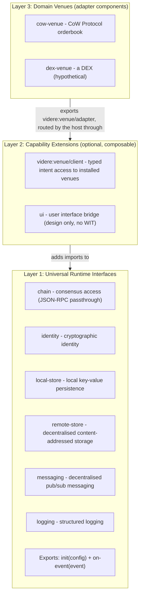

# Platform Generalisation

> **Status (0.2):** the WIT contract is host-portable; the reference server runtime (docs 01-07) is its sole implementation. Mobile, WebView, and super-app hosts are design direction only and ship nothing in 0.2.

A module compiles against `nexum:host/event-module`. Any host that implements the required interfaces runs the same module binary; platforms differ only in how they back those interfaces. This document defines the layered world model, the universal interface set, and the venue-adapter extension mechanism. [Doc 00](00-overview.md) owns the six-primitive taxonomy.

## Layered WIT Worlds

Universal runtime capabilities and domain-specific surfaces live in separate layers:



Layer 1 is the world every module compiles against. A Layer 2 capability adds an import to a module's manifest-derived world: a keeper module declares `client` and gains `videre:venue/client`. Layer 3 is not a world: a domain enters as a venue adapter component installed into the host's venue registry, and modules reach it through the Layer 2 client interface. No module compiles against a domain world.

## Layer 1: Universal Interfaces

Six interfaces form the universal runtime contract. The signatures below are the shipped `wit/nexum-host` package.

### `chain`

Forwards JSON-RPC to the host's provider infrastructure, plus a batched variant. The reference server host forwards a read-only method surface and refuses signing or mutating methods (`eth_sendTransaction`, `eth_sign`, `personal_sign`, ...) with a `denied` fault before they reach the provider.

```wit
interface chain {
    use types.{chain-id, fault};

    record rpc-error { code: s32, message: string, data: option<list<u8>> }
    variant chain-error { fault(fault), rpc(rpc-error) }
    record rpc-request { method: string, params: string }
    variant rpc-result { ok(string), err(chain-error) }

    /// `method` includes the namespace prefix (e.g. "eth_call"); `params`
    /// and the success value are JSON-encoded strings.
    request: func(chain-id: chain-id, method: string, params: string)
        -> result<string, chain-error>;

    /// Batched JSON-RPC over one chain. The result list matches `requests`
    /// in length and order; hosts that cannot batch natively fall back to
    /// sequential `request` calls.
    request-batch: func(chain-id: chain-id, requests: list<rpc-request>)
        -> result<list<rpc-result>, chain-error>;
}
```

The SDK's `HostTransport` (doc 07) implements alloy's `Transport` trait over `chain::request` / `chain::request-batch`, so module authors get the alloy `Provider` API regardless of host.

### `identity`

Account enumeration and signing. ECDSA secp256k1 by default. The reference server host leaves this interface unimplemented: `accounts` returns an empty roster and `sign` / `sign-typed-data` return the `unsupported` fault. A keystore / KMS backend is not yet shipped.

```wit
interface identity {
    use types.{fault};

    /// Account addresses (20-byte EVM) the host will sign for. Empty means
    /// no signing capability.
    accounts: func() -> result<list<list<u8>>, fault>;

    /// personal_sign semantics; returns a 65-byte signature.
    sign: func(account: list<u8>, message: list<u8>) -> result<list<u8>, fault>;

    /// Sign EIP-712 typed data; `typed-data` is JSON-encoded.
    sign-typed-data: func(account: list<u8>, typed-data: string) -> result<list<u8>, fault>;
}
```

### `local-store`

The module's private, device-local scratchpad. Scoped to one module: module A cannot read module B's state. Does not replicate.

```wit
interface local-store {
    use types.{fault};

    get: func(key: string) -> result<option<list<u8>>, fault>;
    /// The host may enforce a size quota; if exceeded, `set` returns err.
    set: func(key: string, value: list<u8>) -> result<_, fault>;
    delete: func(key: string) -> result<_, fault>;
    /// Empty prefix returns all keys.
    list-keys: func(prefix: string) -> result<list<string>, fault>;
    contains: func(key: string) -> result<bool, fault>;
    len: func(key: string) -> result<option<u64>, fault>;
    count: func(prefix: string) -> result<u64, fault>;
}
```

The server runtime's transactional semantics (doc 04) are an implementation detail, not a cross-platform guarantee; modules that need stronger guarantees design for idempotency.

### `remote-store`

Backed by Ethereum Swarm: content-addressed persistence beyond the local device, plus mutable feeds. The same network modules are distributed through (docs 02, 03).

```wit
interface remote-store {
    use types.{fault};

    /// Returns the 32-byte content reference (Swarm address).
    upload: func(data: list<u8>) -> result<list<u8>, fault>;
    download: func(reference: list<u8>) -> result<list<u8>, fault>;

    /// Feeds are mutable pointers (owner, topic) -> latest chunk.
    read-feed: func(owner: list<u8>, topic: list<u8>) -> result<option<list<u8>>, fault>;
    /// The host signs the update with its configured identity; the owner
    /// is implicit. Returns the 32-byte reference of the new chunk.
    write-feed: func(topic: list<u8>, data: list<u8>) -> result<list<u8>, fault>;
}
```

### `messaging`

Backed by Waku: transient, topic-based pub/sub. Sending uses `publish`; receiving is declared as a manifest subscription and delivered through `on-event`.

```wit
interface messaging {
    use types.{fault, message};

    /// Content topics follow /<app>/<version>/<topic>/<encoding>.
    publish: func(content-topic: string, payload: list<u8>) -> result<_, fault>;
    query: func(
        content-topic: string,
        start-time: option<u64>,
        end-time: option<u64>,
        limit: option<u32>,
    ) -> result<list<message>, fault>;
}
```

```toml
[[subscription]]
kind = "message"
content_topic = "/nexum/1/twap-updates/proto"
```

### `logging`

```wit
interface logging {
    enum level { trace, debug, info, warn, error }
    log: func(level: level, message: string);
}
```

### Universal world definition

The shared types and the `event-module` world:

```wit
package nexum:host@0.1.0;

interface types {
    type chain-id = u64;

    record block { chain-id: chain-id, number: u64, hash: list<u8>, timestamp: u64 }

    record chain-log {
        address: list<u8>, topics: list<list<u8>>, data: list<u8>,
        block-hash: option<list<u8>>, block-number: option<u64>,
        block-timestamp: option<u64>, transaction-hash: option<list<u8>>,
        transaction-index: option<u64>, log-index: option<u64>, removed: bool,
    }
    record chain-logs { chain-id: chain-id, logs: list<chain-log> }
    record tick { fired-at: u64 }
    record message {
        content-topic: string, payload: list<u8>, timestamp: u64,
        sender: option<list<u8>>,
    }
    /// A domain extension's own event kind and opaque payload; the core
    /// routes by `kind` and never reads `payload`.
    record custom-event { kind: string, payload: list<u8> }

    variant event {
        block(block), chain-logs(chain-logs), tick(tick),
        message(message), custom(custom-event),
    }

    type config = list<tuple<string, string>>;

    variant fault {
        unsupported(string), unavailable(string), denied(string),
        rate-limited(rate-limit), timeout, invalid-input(string), internal(string),
    }
    record rate-limit { retry-after-ms: option<u64> }
}

/// Event-driven module. No UI capabilities. Runs on any conforming host.
world event-module {
    import chain;
    import identity;
    import local-store;
    import remote-store;
    import messaging;
    import logging;

    export init: func(config: types.config) -> result<_, fault>;
    export on-event: func(event: types.event) -> result<_, fault>;
}
```

Time, randomness, and outbound HTTP are WASI concerns, not `nexum:host` interfaces: `wasi:clocks` and `wasi:random` are linked into every module store; `wasi:http/outgoing-handler` is linked gated per-module by the `[capabilities.http].allow` allowlist.

The experimental `nexum:host/query-module` world (a pure `evaluate` entry point over `local-store` and `logging`) is published but has no host implementation in 0.2.

## Layer 2: Capability Extensions

A capability adds imports to a module's manifest-derived world beyond the Layer 1 core. Two are additive, declared in the manifest's `[capabilities]` section and not part of the six-primitive core:

- `client`: the `videre:venue/client` intent surface (see [Layer 3](#layer-3-domain-extensions-venue-adapters)).
- `http`: allowlisted `wasi:http/outgoing-handler`.

A `ui` interface for interactive modules (a bridge between module logic and a host UI surface) is designed but ships no WIT; there is no `app-module` world in 0.2.

## Layer 3: Domain Extensions (Venue Adapters)

A domain (CoW Protocol, a DEX, a lending market) extends the platform as a **venue adapter**: a component authored with `#[videre_sdk::venue]` that exports the `videre:venue/adapter` interface and imports scoped transport only (`chain`, `messaging`, allowlisted `wasi:http`). The domain's wire protocol, body codec, and error projection live inside the adapter component; nothing domain-specific enters the host or any module world.

```wit
package videre:venue@0.1.0;

/// Worker (keeper) face. The host holds the venue registry; the keeper
/// names a venue by string.
interface client {
    use videre:types/types.{quotation, receipt, intent-status, submit-outcome, venue-error};

    quote:  func(venue: string, body: list<u8>) -> result<quotation, venue-error>;
    submit: func(venue: string, body: list<u8>) -> result<submit-outcome, venue-error>;
    observe: func(venue: string, receipt: receipt) -> result<_, venue-error>;
    status: func(venue: string, receipt: receipt) -> result<intent-status, venue-error>;
    cancel: func(venue: string, receipt: receipt) -> result<_, venue-error>;
}

/// Provider (venue) face. Mirrors `client` without the venue selector:
/// one installed adapter answers for exactly one venue.
interface adapter {
    use videre:types/types.{intent-header, quotation, receipt, intent-status, submit-outcome, venue-error};

    body-versions: func() -> list<u32>;
    derive-header: func(body: list<u8>) -> result<intent-header, venue-error>;
    quote:  func(body: list<u8>) -> result<quotation, venue-error>;
    submit: func(body: list<u8>) -> result<submit-outcome, venue-error>;
    status: func(receipt: receipt) -> result<intent-status, venue-error>;
    cancel: func(receipt: receipt) -> result<_, venue-error>;
}
```

The two faces meet in the host. The venue platform (`crates/videre-host`, one `nexum-runtime` extension registered at the composition root) holds the `VenueRegistry`, links `videre:venue/client` into keeper worlds, and routes each call: resolve the venue id to its installed adapter, run the advisory egress guard over the adapter's pure `derive-header` projection, then invoke the adapter face. Accepted submits go under a status watch; the platform polls the adapter's `status` and fans transitions back to subscribed modules as `intent-status` events. Intent bodies are opaque on this path; typing is a guest-side agreement between keeper and adapter over the venue's published `IntentBody` schema ([doc 05](05-sdk-design.md#bodies-the-intentbody-derive)).

A new domain adds a component and (usually) a body crate, never a WIT package or a host change: write the adapter with `#[videre_sdk::venue]`, publish its codec vectors and header goldens, and install it via the engine's `[[adapters]]` table. The `shepherd` binary is exactly this composition: the core lattice plus the videre platform, with CoW entering only as the bundled `cow-venue` adapter.

### The legacy read path: `shepherd:cow`

The retired predecessor to venue adapters was a Layer-3 *world* extension: a `shepherd:cow/cow-api` interface (orderbook passthrough plus `submit-order`), a `shepherd` world importing it, and a host-side extension cone implementing it over a cached orderbook client. That path is deleted. The `cow-api` interface, the `shepherd` / `cow-ext` worlds, and the host cone are gone; orderbook I/O lives in the `cow-venue` adapter behind `videre:venue/client`. The `shepherd:cow` package remains only as `cow-events`, the package of record for the CoW on-chain event ABIs (signatures and topic-0 hashes) that keeper manifests and decoders are parity-tested against. [ADR-0005](adr/0005-cow-api-via-cached-orderbookapi.md) and [ADR-0006](adr/0006-cow-twap-ethflow-host-helpers.md) are superseded accordingly.

## Complete WIT Package Layout

```
wit/
├── nexum-host/
│   ├── types.wit              # chain-id, block, log, tick, message, custom-event, event, config, fault
│   ├── chain.wit              # chain interface (request + request-batch)
│   ├── identity.wit           # identity interface (accounts, signing)
│   ├── local-store.wit
│   ├── remote-store.wit       # Swarm
│   ├── messaging.wit          # Waku
│   ├── logging.wit
│   ├── event-module.wit       # event-module world (6 imports)
│   └── query-module.wit       # experimental: no host impl in 0.2
│
├── videre-value-flow/
│   └── types.wit              # asset + asset-amount vocabulary
├── videre-types/
│   └── types.wit              # intent-header, quotation, receipt, submit-outcome, intent-status, venue-error
├── videre-venue/
│   └── venue.wit              # client + adapter interfaces, venue-adapter world
└── shepherd-cow/
    └── cow-events.wit         # CoW event-ABI package of record (legacy package name)
```

The `nexum-host` package is domain-agnostic. The `videre` packages are the venue-neutral intent contract. `shepherd-cow` carries only the CoW event ABIs. New domains add adapter components, not packages.

## Platform Targets

The reference server runtime is the sole host. `shepherd` is the composition root: it registers the videre venue platform and bundles the `cow-venue` adapter over the core lattice (alloy provider pool for `chain`, redb for `local-store`, Bee for `remote-store`, Waku for `messaging`, `tracing` for `logging`, wasmtime Component Model engine).

Mobile (Flutter embedding a WASM runtime), WebView (browser WASM engine with host functions injected over a JavaScript bridge), and a decentralised super app (ENS discovery plus Swarm distribution over the same interfaces) are design directions the portable WIT contract is shaped to admit; none ships in 0.2.

## SDK Layering

[Doc 05](05-sdk-design.md) owns the SDK. In summary: `nexum-sdk` is the universal SDK for `nexum:host/event-module`; `videre-sdk` is the venue layer serving both venue faces; per-venue crates (`cow-venue`, `composable-cow`) sit on the venue layer. No crate re-exports another. Non-Rust authors use `wit-bindgen` directly against the WIT.
