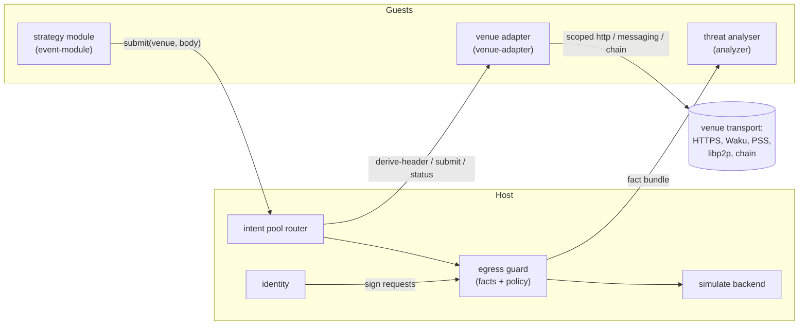
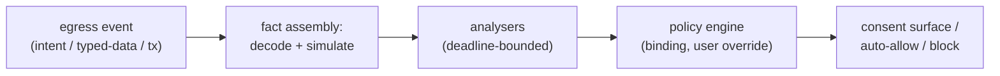

# Intent Architecture: Venue Adapters and the Egress Guard

> **Status (design, 0.3+ direction):** This document records the target architecture agreed in the July 2026 architecture review. Nothing in it ships in 0.2. It supersedes the CoW-specific framing of the Layer 3 example in [08-platform-generalisation.md](08-platform-generalisation.md) and the compiled-in `cow-api` backend of ADR-0005. Decision records: [ADR-0010](adr/0010-venues-as-adapter-components.md) (venue adapters) and [ADR-0011](adr/0011-egress-guard-pipeline.md) (the guard pipeline).

## Motivation

Three pressures converge on the same design:

1. **CoW is a concrete implementation living inside a generic runtime.** `shepherd:cow/cow-api` and the `cow_orderbook` host backend are the only domain-specific code in the engine. A CoW order is one instance of a more general thing: an intent to give some value in exchange for some other value, submitted to a venue that settles it. The next domains on the roadmap are not further ERC-20 swap venues; they are a non-trading chain domain (a Swarm postage purchase: give BZZ, want storage capacity for a duration) and an off-chain marketplace (real-world assets, where settlement is a legal process rather than a chain state transition).
2. **Venues arrive after the app ships.** On the super-app and mobile targets (doc 08), a new venue must be installable by the user without an app-store deployment. That rules out compiled-in venue backends: the venue integration must itself be a distributable, sandboxed artifact, discovered and installed exactly like a module.
3. **The same engine embeds in a wallet.** The wallet embedding places the runtime at the signing boundary, where EIP-712 typed data and transaction payloads must be decoded, simulated, and analysed for threats before the user signs. The threat analysis itself should be performed by installable wasm modules, so that security vendors ship analysers the way strategy authors ship modules.

The unifying observation: intent submission, typed-data signing, and transaction signing are all **value egress events**. They deserve one vocabulary, one analysis pipeline, and one policy surface.

## Component kinds

The platform grows from one guest component kind to three. All three share the distribution pipeline (ENS discovery, Swarm fetch, content-hash verification, manifest, install-time consent) and the supervision machinery (restart policy, poison handling, fuel and epoch metering, capability enforcement).

| Kind | World | Role | Trust position |
|---|---|---|---|
| Strategy module | `event-module` (existing) | Owns strategy: when to emit intents, polling cadence, retry policy | Arbitrary author; capability-scoped |
| Venue adapter | `venue-adapter` (new) | One venue each: encodes intent bodies, derives headers, submits, observes status, over whatever transport the venue speaks | Curated registry plus ENS escape hatch; structurally cannot move value |
| Threat analyser | `analyzer` (new; descendant of the experimental `query-module` world) | Evaluates egress fact bundles, returns verdicts under a deadline | Tiered: pure fact-fed by default; network extras behind explicit consent |



## The value-flow vocabulary

One WIT types package, egress-neutral, describes value in motion. It is shared by intent headers, simulation balance diffs, and analyser verdict subjects, so that "100 USDC leaves the user's control" is written the same way in all three places. This vocabulary is the real platform contract; it must outlive any individual interface and is the part that freezes hardest.

Sketch (illustrative, not frozen):

```wit
package nexum:value@0.1.0;

interface types {
    variant settlement {
        evm-chain(u64),
        offchain(string),      // jurisdiction / venue-defined domain
    }

    variant asset {
        native(settlement),
        erc20(tuple<u64, list<u8>>),             // (chain, address)
        erc721(tuple<u64, list<u8>, list<u8>>),  // (chain, address, id)
        erc1155(tuple<u64, list<u8>, list<u8>>),
        service(service-desc),                    // e.g. storage capacity for a duration
        external(external-desc),                  // RWA: deed, chattel, ...
    }

    record asset-amount { asset: asset, amount: list<u8> }  // big-endian unsigned
}
```

Design notes:

- `settlement` is a variant from day one. The current `chain-id: u64` plumbing assumes every venue settles on an EVM chain; the off-chain marketplace target breaks that assumption.
- `service` and `external` exist so a postage purchase and a physical-asset listing fit without forcing them into token shapes. For `external` assets the host can verify nothing; policy on them is plugin-attested, not host-verified, and the consent surface must say so.
- Policy has teeth on `gives` (what leaves the user's control). `wants` is display-grade: the host can rarely verify the counterparty's obligation and must not pretend to.

## Intents and venue adapters

### The intent core

```wit
package nexum:intent@0.1.0;

interface types {
    use nexum:value/types.{asset-amount, settlement};

    record intent-header {
        gives: list<asset-amount>,
        wants: list<asset-amount>,
        valid-until: option<u64>,
        settlement: settlement,
        authorisation: auth-scheme,   // eip712 | eip1271 | presign | offchain-sig | none
    }

    variant intent-status { pending, open, settled(option<list<u8>>), failed(fail-reason), expired, cancelled }
    type receipt = list<u8>;          // venue-scoped stable id (CoW: the 56-byte order UID)
}

interface pool {
    submit: func(venue: string, body: list<u8>) -> result<receipt, venue-error>;
    status: func(venue: string, receipt: receipt) -> result<intent-status, venue-error>;
    cancel: func(venue: string, receipt: receipt) -> result<_, venue-error>;
}
```

The body is opaque bytes at the pool boundary. Typing is recovered in two places where it is real: guest-side, where venue authors publish typed SDK crates for strategy modules, and at the adapter's `derive-header` export, whose return type is the stable ontology. There is no closed `intent-body` variant to churn per venue, and no way for a module to claim a header the host has not derived.

Bodies carry their own routing: `pool::submit` has no chain parameter. A multichain venue's body schema includes the chain, the adapter resolves the per-chain endpoint, and the derived header's `settlement` field exposes the choice to policy. Body encodings are borsh with an outer version enum per venue (see SDK surfaces below): deterministic bytes, a written cross-language specification, and unknown versions rejected with a typed error.

A fifth event variant, `intent-status(receipt, status)`, is delivered through the existing manifest-subscription mechanism. For HTTP venues the adapter polls; for Waku or PSS venues it subscribes; strategy modules receive identical events either way. Observation is first-class because one of the two flagship modules (ethflow-watcher) is observe-only: it verifies that intents created by others were indexed by the venue, and never submits.

### The adapter world

```wit
world venue-adapter {
    // narrow, manifest-declared, per-adapter-scoped imports:
    import http;        // e.g. the CoW adapter: api.cow.fi only
    import messaging;   // e.g. a Waku venue: its content topics only
    import chain;       // read-only lookups where needed

    export derive-header: func(body: list<u8>) -> result<intent-header, venue-error>;
    export submit: func(body: list<u8>) -> result<receipt, venue-error>;
    export status: func(receipt: receipt) -> result<intent-status, venue-error>;
    export cancel: func(receipt: receipt) -> result<_, venue-error>;
}
```

The host is a router plus a policy checkpoint: a strategy module calls `pool::submit(venue, body)`; the host resolves the venue id to the installed adapter instance, calls its `derive-header`, runs guard policy on the result (see below), and only then forwards to the adapter's `submit`. Adapters never see keys, never import `identity`, and hold no unscoped transport, so a hostile adapter can misdescribe or grief (drop, delay, leak order details the venue would see anyway) but cannot steal.

Transport is entirely the adapter's concern. A venue reachable over HTTPS, Swarm PSS, Waku, raw libp2p, or an on-chain contract call presents the same four exports; the module and the host router are transport-blind. This is the same shape as `chain::request` (the module says what, the host decides how) extended to one more decision layer.

The minimal surface is deliberate. Both flagship modules need only `submit` and `status` (twap-monitor submits, ethflow-watcher observes), with `cancel` reserved for a future refunder. In particular there is no venue read path in the flagship set: a CoW order's `app-data` travels as the 32-byte hash exactly as returned on-chain, because the orderbook accepts hash-only submissions and joins the pre-registered document on its side; nothing needs fetching. A read-only `query` verb (quotes, venue metadata) is deferred until a strategy needs one (see open questions).

### Curation and consent

Adapters install like modules, with two provenance tiers:

- **Curated registry (default):** a platform-signed list of adapter content hashes. Installing from it shows the standard consent sheet (publisher, venue, transport scopes).
- **ENS escape hatch:** any ENS-published adapter installs behind a stronger warning. Header trust then equals publisher trust, and the consent copy says exactly that.

Adapters are always separate artifacts from strategy modules: one adapter per venue, shared by all modules, separately consented. A module author who also authors a venue needs two visible installs, which keeps collusion observable.

### What stays where

The strategy versus protocol boundary from ADR-0006 is preserved, not repealed. Strategy stays guest-side in modules: polling cadence, condition evaluation, revert-taxonomy interpretation, when to give up. What moves out of the engine and into adapters is encoding, transport, and observation. The SDK gains a venue-generic chassis for the machinery both flagship modules already implement by hand: watch-set persistence, gate keys, idempotency journals keyed on receipts, retry classification. Porting the pattern to a new venue means implementing the adapter plus a thin typed SDK crate; the tested machinery travels.

## The egress guard

### One pipeline for all value egress

Three event classes produce the same fact-bundle shape and flow through the same spine:

1. **Intent submission** (from the pool router, header derived by the venue adapter),
2. **Typed-data signing** (EIP-712 requests arriving at `identity::sign-typed-data`),
3. **Transaction signing** (raw transactions arriving at `identity` via `chain::request` signing methods).



The wallet embedding is a host profile where transaction and typed-data events dominate and the consent surface is the wallet UI (driven over the embedding API). The server runtime is a profile where intent submissions dominate and policy is operator configuration. Same pipeline, same analysers, same vocabulary.

### Fact assembly and the `simulate` primitive

The host assembles a typed fact bundle per event: the decoded payload (EIP-712 struct and domain, transaction fields, or intent header plus venue id), simulation results (balance diffs and approvals granted, expressed in `nexum:value` types), and context metadata (counterparty contract, chain, requesting component).

Simulation is a pluggable host primitive, additive alongside `clock` and `http`:

- **Server and desktop:** a local EVM (revm) over the provider pool's state access.
- **Mobile:** cold-state simulation over mobile RPC can take seconds, so the host may use an operator- or user-configured remote simulation backend. That trades transaction privacy for latency and the trade is made explicitly in configuration and surfaced in consent, never silently.

One WIT contract either way; analysers and policy are backend-blind.

### Authorisation classes

The guard classifies every egress event by where its authorisation comes from, and the class sets the default posture:

- **Host-signed** (EIP-712 via `identity`, transaction signing): the full pipeline, blocking-capable. This is the only class where host-held keys act, so it is the theft boundary.
- **Pre-authorised** (EIP-1271 contract signatures, contract-owner schemes): non-interactive by default. The value egress was consented on-chain when the commitment was created, itself a guarded transaction; the venue accepts submissions permissionlessly, so anyone can materialise a tradeable conditional order (that is what the public watch-tower service does for everyone); and prompting per materialised part would interrupt the user repeatedly for flows they already signed for. The guard records an audit entry and runs analysers in advisory mode; it does not prompt and does not block in the default profile. Note that these flows never touch the identity checkpoint at all: the signature comes back from the chain, so there is nothing for the host to sign.

Two consequences are stated plainly rather than implied. For pre-authorised intents, spend limits are observability, not enforcement: refusing to submit from the local runtime prevents nothing, because any third party can submit the same part; the chain is the enforcement. And advisory analysis on this class is detection, not prevention: a finding like "this part sells far below market" arrives after the commitment exists, but the user can still invalidate the conditional order on-chain before the next part, so the finding is actionable without adding friction.

### Analysers

Analysers are request/response components (the `query-module` lineage): the host calls them with a fact bundle and a deadline, they return a verdict. Capabilities are tiered:

- **Pure core (default):** no imports at all. The analyser computes on the facts it is handed. Deterministic, fast, and nothing to exfiltrate: the natural home for heuristics, decoder cross-checks, and known-bad-pattern matching.
- **Granted extras:** an analyser may request `chain` (its own reads) or scoped `http` (a vendor reputation feed). The consent sheet states the consequence plainly: this analyser sends what you sign to vendor.example. Everything the user signs is exactly the data a network-capable analyser could leak, so the tier boundary is the privacy boundary.

Verdicts carry a severity and a typed subject (which `gives` entries they concern). They are policy-binding with per-event user override: high-severity findings block by default, the user can override with friction. Analyser timeout or crash during an interactive prompt resolves per policy profile: a wallet profile fails closed for high-value egress, a server profile may fail open with logging. The choice is explicit configuration, not an accident of scheduling.

## SDK surfaces and the component boundary

Two authoring personas share the boundary: the venue author (the adapter component plus the types module authors consume) and the module author (strategy against the chassis plus venue clients). The SDK design serves both without weakening the host's position in the middle.

### No direct module-to-adapter linking

Component-model composition (linking the module's `pool` import straight to the adapter's exports) looks like an optimisation and is a correctness bug three ways: the host must interpose policy between `derive-header` and `submit`; wasmtime fuel is per-store, so host-in-the-middle is what keeps module work on the module's meter and adapter work on the adapter's; and an adapter trap must not poison the calling module (separate stores, separate restart policies). Every hop is module to host to adapter, and the SDK's job is to make that feel like a typed function call.

### Boundary cost, calibrated

Each crossing is a canonical-ABI lift/lower: one copy of the body between linear memories per hop. Intent bodies are small control-plane payloads (an order is under a kilobyte); two hops plus a policy re-decode cost single-digit microseconds against a venue round trip of tens to hundreds of milliseconds. The boundary is optimised for determinism and type safety, not nanoseconds. Where speed genuinely matters, the design already provides for it: adapters and analysers are long-lived pre-instantiated instances, and analysers on the interactive signing path are pure fact-fed with epoch deadlines. The one accepted inefficiency is the double decode of a body (once for `derive-header`, once for `submit`); if profiling ever disagrees, the fix is a WIT resource handle so the adapter retains the decoded body between the two router-sequenced calls, and it is not built speculatively.

### The body codec is borsh, and a venue is a specification

Body encodings need deterministic bytes (receipts and audit records may hash them), compactness, no_std encode/decode, schema evolution, and implementations beyond Rust, because module authors are not all Rust authors. Borsh satisfies all five (a written spec, maintained Python/JS/Go implementations); versioning is an outer enum per venue, so adding a version is non-breaking and unknown versions fail typedly.

Consequently a venue is normatively defined by language-neutral artefacts, not by a crate: the borsh body schema per version, golden vectors (body bytes and the expected derived header), and the submission error-classification table as data (a small table mapping venue error kinds to try-next-block, backoff, or drop). The venue author's Rust crate is the first-class implementation of that specification, not its definition. The conformance kit exports the vectors as files precisely so a non-Rust module can prove byte-exactness in its own test suite, and shipping the classification table as data keeps retry policy guest-side (the ADR-0006 boundary) while making it portable across languages.

### Crate map

| Crate | Persona | Contents |
|---|---|---|
| `nexum-sdk` | module authors | host traits, `#[nexum::module]`, the materialiser chassis, typed intent client core |
| `nexum-sdk-test` | module authors | `MockHost` plus a programmable `MockVenue` |
| `nexum-venue-sdk` | venue authors | `VenueAdapter` trait, `#[nexum::venue]`, the body-codec derive, typed wrappers over scoped transport imports |
| `nexum-venue-test` | venue authors | conformance kit: codec round-trip vectors, header-derivation goldens, `MockTransport` |
| per-venue crate (e.g. the CoW venue) | venue author publishes, both consume | default feature: body types and codec; `client`: typed client and retry classification for modules; `adapter`: the adapter component implementation |

The one-crate-per-venue rule keeps the body schema in exactly one place, consumed from both sides of the boundary, so codec drift between a Rust module and the adapter is a compile error rather than a runtime rejection. Both proc macros exist to remove the per-cdylib glue tax recorded in ADR-0009, and they emit the per-component world matching the manifest's declared capabilities, which retires the import-elision dependency that ADR flagged as load-bearing.

### Metering and attribution

Guest compute is metered per component store (fuel plus epoch interruption), for adapters and analysers exactly as for modules. Fuel cannot cross stores, so a hostile module spamming undecodable bodies would burn the adapter's budget; the router closes this with per-caller submission quotas and by charging decode failures against the calling module's quota before the adapter is invoked again. Transport is governed host-side by the existing middleware (timeout, retry, rate limit) on each adapter's scoped imports.

### Non-Rust module authors

The WIT is the contract and the Rust SDK is an ergonomics layer, so a Python module (for example) is built with componentize-py against the module world and gets generated typed bindings for every import, including the pool. Metering, supervision, and capability enforcement apply identically; the interpreter is pre-initialised at build time so instantiation stays cheap, the component is larger and burns more fuel per unit of logic, and both costs land on the module's own budget. Pure-language dependencies only (no native extensions), which the venue's published schema, vectors, and classification table are designed for: everything protocol-critical is data, not Rust code. The chassis itself is Rust-only convenience; a non-Rust author hand-rolls the watch/gate/idempotency loop or uses a community helper package.

### Examples

The repository ships one example per persona plus the real thing: an echo venue (accepts any body, settles instantly; the tutorial artefact and the conformance kit's test target), an example module driving it through the chassis, and the CoW adapter as the production reference. The SDK design doc (doc 05) gains the venue persona alongside the existing module persona.

## Trust model summary

| Guarantee | Enforced by | Trust required |
|---|---|---|
| Adapter cannot move value | Sandbox: no `identity` import, no keys, scoped transport | None (structural) |
| Spend limits, consent summaries | Guard policy on host-routed, adapter-derived headers | Adapter publisher (curated registry or explicit ENS consent) |
| Theft prevention on signed egress | Guard at the `identity` boundary: EIP-712 and tx payloads are self-describing, the host decodes and simulates them itself | Host only |
| Contract-authorised flows (e.g. EIP-1271 conditional orders) | Consented on-chain when the commitment was created; guests can only materialise what the contract permits | On-chain approval hygiene |
| Threat verdicts | Analyser components under deadline, tiered capabilities | Analyser publisher, proportional to granted tier |

Honest limitations, carried deliberately: policy on `external` (RWA) assets is adapter-attested rather than host-verified; adapter misbehaviour of the griefing grade (delay, drop, leak) is handled by curation and reputation rather than mechanism; and `wants` is display-grade.

## Sequencing

Each step is independently shippable and the earlier steps are pure wins even if later ones change shape.

1. **Hygiene:** move the `cow_orderbook` backend out of the engine behind the RuntimeTypes extension seam; remove `CowApiHost` from the SDK supertrait. The engine becomes domain-free; shepherd is the distribution that bundles the CoW integration.
2. **SDK chassis:** extract the conditional-commitment machinery (watch sets, gate keys, idempotency journals, retry ledgers) from twap-monitor and ethflow-watcher into venue-generic SDK traits. This delivers watch-tower-parity transportability with no WIT change.
3. **Intent core:** `nexum:value` and `nexum:intent` at 0.x, the `venue-adapter` world, the host router with supervisor reuse, and the CoW adapter built as a component from day one (bundled with the shepherd distribution; bundled is not compiled-in). Alongside it: `nexum-venue-sdk`, the `#[nexum::module]` and `#[nexum::venue]` macros, and the echo-venue example pair as the tutorial artefacts. Port both flagship modules; ethflow proves observe-only and the status-event path.
4. **Guard, first cut:** the `simulate` primitive (local backend), fact assembly, the `analyzer` world, policy binding with override, and the identity-boundary checkpoint for typed-data and transaction signing.
5. **Postage adapter (N=2):** proves `service` wants, non-HTTP transport thinking, and settlement variance. Freeze the vocabulary at 1.0 only after this round-trips submit, status, and policy.
6. **Registry and consent:** the curated adapter/analyser registry, publisher display, the ENS escape hatch, and the wallet-profile consent surface over the embedding API.

## Open questions

- **Vocabulary freeze discipline:** `nexum:value` becomes forward-compatibility-critical for three consumers at once. The N=2 gate (step 5) is the guard, but the versioning policy for post-1.0 additions (new asset variants) needs its own note.
- **Analyser composition:** multiple analysers with overlapping findings need aggregation rules (max severity wins is the obvious start) and a story for contradictory verdicts.
- **A `tx` venue:** transactions are covered by the guard at the identity boundary, not modelled as an intent venue. Whether a transaction-shaped venue adapter (batching, private orderflow) is ever worth registering stays open; the policy hooks are shaped so it could be.
- **Adapter reputation:** beyond curation, whether observed adapter behaviour (submission latency, status accuracy) feeds a local score.
- **A read-only venue `query` verb:** quotes and venue metadata have no consumer among the flagship modules (app-data travels as a hash; see the adapter section), so the verb waits for a strategy that needs it. When it lands it is guard-free, because reads are not egress.
